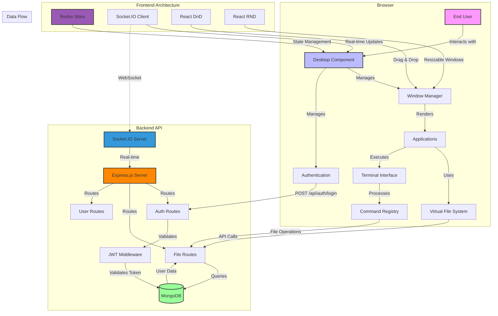
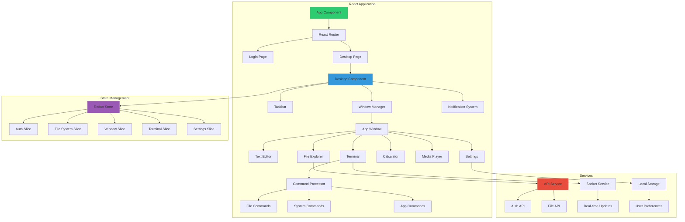

[](https://github.com/gongahkia/penguin/releases/tag/1.0.0)

# `Penguin`

Interactive Custom Operating System Simulation for the Browser with [Complete Desktop Environment](#stack), [Virtual File System](#usage), and [Multi-user Workspaces](#architecture).

## Rationale

Ever wanted to experience a full desktop operating system without leaving your browser? What if you could run multiple applications, manage files, and even collaborate with others in real-time, all within a web application?

I built [Penguin](https://github.com/gongahkia/penguin) to scratch that itch. Takeaways [here](#other-notes).

## Stack

* *Frontend*: [React](https://react.dev/), [TypeScript](https://www.typescriptlang.org/), [Redux Toolkit](https://redux-toolkit.js.org/), [Vite](https://vite.dev/)
* *Backend*: [Express.js](https://expressjs.com/), [Node.js](https://nodejs.org/), [Socket.IO](https://socket.io/)
* *Database*: [MongoDB](https://www.mongodb.com/), [Mongoose](https://mongoosejs.com/)
* *Auth*: [JWT](https://jwt.io/), [bcrypt](https://github.com/kelektiv/node.bcrypt.js)
* *Package*: [Docker](https://www.docker.com/), [Docker Compose](https://docs.docker.com/compose/)
* *Testing*: [Jest](https://jestjs.io/), [React Testing Library](https://testing-library.com/docs/react-testing-library/intro/), [Playwright](https://playwright.dev/)

## Usage

The below instructions are for locally hosting `Penguin`.

1. First execute the below.

```console
$ git clone https://github.com/gongahkia/penguin && cd penguin
```

2. Configure environment and dependencies.

```console
$ cp server/.env.example server/.env
$ npm run install:all
```

3. Start with Docker Compose (recommended) or run locally.

```console
# Docker approach
$ docker-compose up -d

# Local development approach
$ docker run -d -p 27017:27017 --name penguin-mongo mongo:7.0
$ npm run dev
```

4. Access the application at `http://localhost:3000`

## Endpoints

For testing the [Node.js backend](./server/) API directly.

1. First run the backend server.

```console
$ cd server && npm run dev
```

2. Use `curl` to test API endpoints.

| Endpoint | Method | Purpose | Example |
| :--- | :--- | :--- | :--- |
| `/api/auth/register` | POST | User registration | `curl -X POST http://localhost:3001/api/auth/register -H "Content-Type: application/json" -d '{"username": "user", "email": "user@example.com", "password": "password123"}'` |
| `/api/auth/login` | POST | User authentication | `curl -X POST http://localhost:3001/api/auth/login -H "Content-Type: application/json" -d '{"email": "user@example.com", "password": "password123"}'` |
| `/api/files` | GET | Get user files | `curl -X GET http://localhost:3001/api/files -H "Authorization: Bearer <JWT_TOKEN>"` |
| `/api/files` | POST | Create file/folder | `curl -X POST http://localhost:3001/api/files -H "Authorization: Bearer <JWT_TOKEN>" -H "Content-Type: application/json" -d '{"name": "test.txt", "type": "file", "content": "Hello World"}'` |

## Architecture

### Overview



### Frontend Components



## Other notes

Building an operating system in the browser taught me the importance of state management, real-time synchronization, and modular architecture. [React](https://react.dev/) with [TypeScript](https://www.typescriptlang.org/) provides excellent tooling for complex applications.